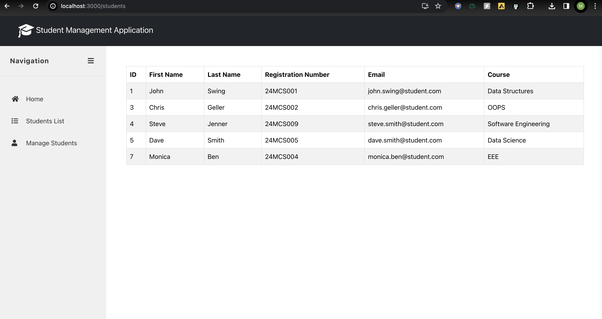
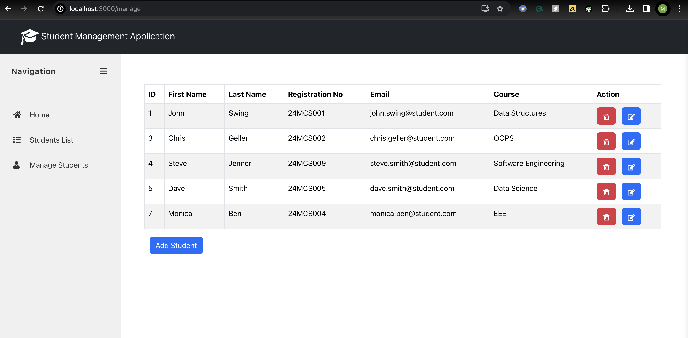
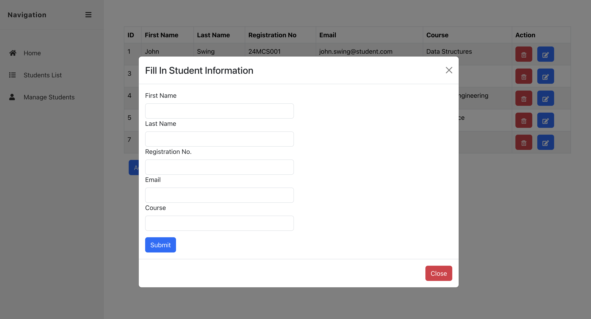

# Student Management System

## Overview
This Student Management System is a comprehensive web application designed to simplify the management of student records for educational institutions. Built with the powerful combination of **React for the frontend** and **Django along with Django REST Framework for the backend**, it offers a seamless, interactive, and user-friendly experience. Whether you're a teacher, administrative staff, or a student, this system is equipped to handle your needs efficiently.

## Features
- **Student Records Management:** Add, update, and delete student records with ease.
- **Intuitive User Interface:** A clean and modern UI built with React for the best user experience.
- **RESTful API Integration:** Smooth communication between the frontend and backend services through REST API.
- **Responsive Design:** Fully responsive web design that adapts to any device screen.

## Technologies Used
- **Frontend:** React.js
- **Backend:** Django, Django REST Framework
- **Database:** SQLite (Default Django database, can be configured to use others)
- **Other Libraries:** Axios for API calls, Bootstrap for styling

## Getting Started
### Prerequisites
Before you begin, ensure you have the following installed:
- Python (3.8 or later)
- Node.js and npm
- Django (3.x or later)
- Django REST Framework

### Installation
1. Clone the repository:
    ```bash
    git clone https://github.com/yourgithubusername/student-management-system.git
    cd student-management-system
    ```

2. Set up a virtual environment (optional but recommended):
    ```bash
    python -m venv venv
    source venv/bin/activate  # On Windows use `venv\Scripts\activate`
    ```

3. Install Django and Django REST Framework:
    ```bash
    pip install django djangorestframework
    ```

4. Install frontend dependencies:
    Navigate to the frontend directory and install the necessary packages:
    ```bash
    cd path/to/frontend
    npm install
    ```

5. Migrate the database:
    Back in the root directory, apply migrations to set up your database schema:
    ```bash
    python manage.py migrate
    ```

6. Start the backend server:
    ```bash
    python manage.py runserver
    ```

7. Run the frontend application:
    In a new terminal window, navigate to the frontend directory and start the React app:
    ```bash
    npm start
    ```

### Usage
- Navigate to the homepage("Home") to view the dashboard.
- Go to "Students" List to get an overview of student records.
- Explore the "Manage Students" section to update or delete existing records.
- Use the "Add Student" feature to enter new student details into the system.


## Application Screenshots

Here are some screenshots of the Student Management System application:

1. Dashboard
   

2. Student Page
   

3. Manage Students Page
   

4. Add Student Form
   

Feel free to explore more of the application by [installing it](#installation) and [running it](#usage) locally!
